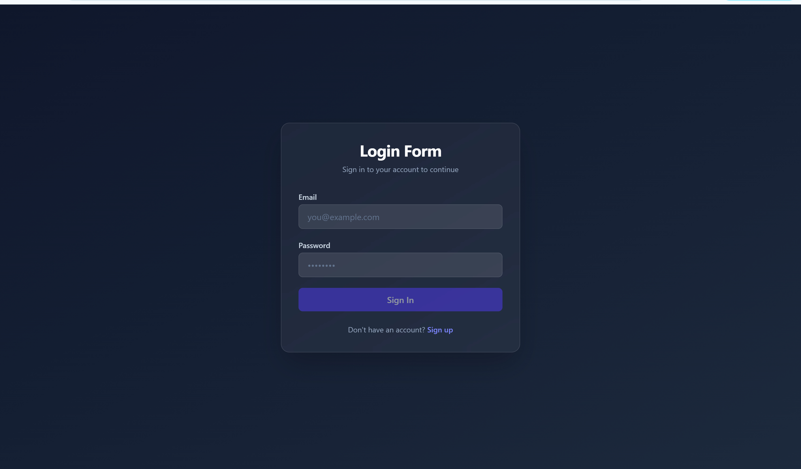

<h1>Hello and welcome to the actual project description of my full stack e-commerce plateform</h1>    

 Spring cart isbuilt With Javas spring framework for the backend, and Angular for the frontend.
springcart is an e-commerce plateform to sell electronic items, with a role based authorization system with Java Spring Security
Java Spring Boot for server side http requests, and a fully featured user experience with Angula  

    <h3>Here is Our Angular login page user interface</h4>
    

    <h3>Here is Our Angular sign-up page user interface</h4>
    

